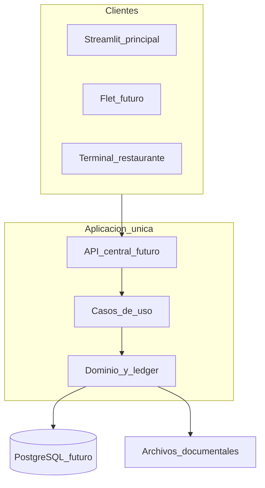

# Arquitectura objetivo — índice (Fase 2)

**Estado:** documentación de diseño. **No implementada en código.**  
**Alcance Fase 2:** solo docs. Sin modelos, serializers, servicios ni fixtures nuevos.

## Documentos de esta fase

| Documento | Contenido |
|-----------|-----------|
| [../modelo_dominio_objetivo.md](../modelo_dominio_objetivo.md) | Entidades, responsabilidades, relaciones, IDs, estados, snapshots, invariantes |
| [../mapa_actual_futuro.md](../mapa_actual_futuro.md) | Tabla modelo actual → modelo futuro |
| [../decisiones_dominio.md](../decisiones_dominio.md) | Decisiones cerradas y pendientes |
| [ledger_movimientos.md](ledger_movimientos.md) | **Ledger conceptual (obligatorio antes de documentos)** |
| [espacios_trabajo.md](espacios_trabajo.md) | Registro / Gestor / Inventario / Configuración |
| [flujo_documental.md](flujo_documental.md) | Albarán → entrada → factura → conciliación (diseño) |

## Principios

1. Una sola fuente de datos (hoy JSON; futuro PostgreSQL).
2. Tres espacios de trabajo en la misma app; no tres sistemas.
3. Reutilizar el núcleo actual (FIFO, `consumos_lote`, soft-anulaciones); no reescribir.
4. Producto maestro independiente del proveedor.
5. Dimensiones separadas: departamento ≠ categoría ≠ ubicación ≠ servicio disponible ≠ tipo de artículo.
6. Documentos ≠ lotes: no convertir `LoteStock` en factura.
7. Importes documentales futuros en `Decimal`; no ampliar `float` en ese módulo.
8. Sin backfill silencioso; históricos incompletos se advierten o bloquean.

## Diagrama de contexto

Hoy Streamlit llama servicios in-process sobre JSON. El objetivo es API + dominio compartido; Streamlit/Flet/terminales son adaptadores.
