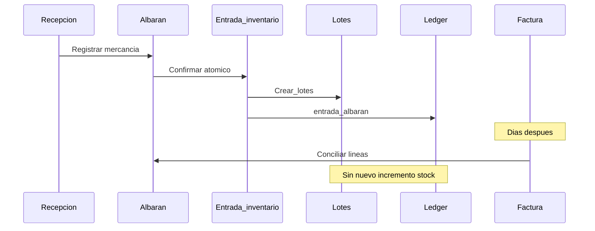

# Flujo documental (diseño — Fase 2)

**No implementar facturas aquí.** Código documental:
- Fase 9: archivos digitales (hash, inmutable) — **hecha**.
- Fase 10: albaranes → entrada — **hecha**.
- Fase 11: facturas + conciliación.
- Fases 12–13: rectificativas / búsqueda-exportación.

## Separación de conceptos

| Concepto | No es |
|----------|-------|
| Proveedor | Producto |
| Documento (cabecera) | Lote |
| Línea documental | Movimiento de stock (aunque lo dispare) |
| Albarán | Factura |
| Archivo original | OCR / datos parseados |
| Conciliación | Nueva entrada de inventario |
| Impuesto versionado | Constante hardcodeada |

## Flujo preferido

## Estados documentales (concepto)

- Borrador → Confirmado → Anulado / Rectificado
- Confirmado: no edición silenciosa; usar rectificativa o anulación con reverso

## Atomicidad

Al confirmar albarán o factura directa: documento + líneas + entrada + lotes + movimientos + auditoría en una unidad de trabajo. Si falla una línea, no guardar parcialmente.

## IDs

ID técnico interno del sistema. **Prohibido** usar “nombre proveedor + fecha” como ID único.
