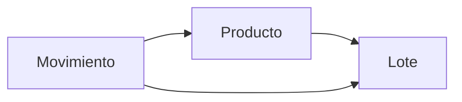

# Ledger de movimientos — modelo conceptual (Fase 2)

**Obligatorio cerrar aquí.** Implementación de código: **Fase 7** (ledger complementario).  
Documentos (albarán/factura) **no** se implementan sin este diseño.

## 1. Problema actual

Hoy el stock vive en `LoteStock.cantidad_restante` y los eventos están implícitos en:

- compras (creación de lote),
- consumo FIFO + `consumos_lote`,
- merma (línea con `lote_id`),
- ajuste (antes/después),
- soft-anulaciones.

No hay tabla/ledger unificado. El objetivo es un **libro append-only de movimientos** que explique todo cambio de stock, sin borrar historia.

## 2. Principios

1. **Append-only:** no editar ni borrar movimientos confirmados; las correcciones son movimientos de reversión.
2. **Complementario al inicio:** Fase 7 escribe ledger **además** del `cantidad_restante` actual; no reemplaza el cálculo hasta reconciliar.
3. **Trazabilidad lote:** todo movimiento que afecte cantidad de un lote referencia `lote_id` (salvo casos explícitos documentados).
4. **Ubicación:** el stock total del hotel ≠ stock por ubicación; un traslado no cambia el total.
5. **Origen documental opcional:** un movimiento puede enlazar documento/línea (albarán, factura, etc.) o un registro operativo (consumo, merma, ajuste).

## 3. Entidad Movimiento (concepto)

| Campo | Descripción |
|-------|-------------|
| `id` | ID técnico interno (string estable; no “proveedor+fecha”) |
| `tipo` | Ver catálogo de tipos |
| `fecha_hora` | Momento efectivo |
| `producto_id` | Producto maestro |
| `lote_id` | Lote afectado (nullable solo si el tipo lo permite y está justificado) |
| `ubicacion_origen_id` | Nullable |
| `ubicacion_destino_id` | Nullable |
| `cantidad` | **Siempre positiva**; el sentido lo da `direccion` o el tipo |
| `direccion` | `entrada` \| `salida` \| `neutra` (traslado interno se modela como par o tipo propio) |
| `cantidad_firmada` | Derivada: `+cantidad` si entrada, `-cantidad` si salida, `0` si neutra pura |
| `coste` | Opcional; snapshot monetario del movimiento (política por tipo) |
| `unidad` | Snapshot de unidad |
| `motivo` / `comentario` | Texto |
| `actor_id` | Usuario/terminal |
| `origen_tipo` | `albaran` \| `factura` \| `registro_consumo` \| `merma` \| `ajuste` \| `traslado` \| `anulacion` \| … |
| `origen_id` | ID del documento o registro origen |
| `origen_linea_id` | Línea documental si aplica |
| `movimiento_reversa_de_id` | Si es reversión, apunta al movimiento original |
| `estado` | `confirmado` \| `anulado_por_reverso` (el original no se borra) |

### Cantidad firmada vs dirección (decisión)

- Persistir **`cantidad > 0`** + **`direccion`**.
- Exponer **`cantidad_firmada`** como campo calculado o materializado para agregaciones.
- Evitar guardar solo un float firmado sin tipo (ambigüedad en traslados).

## 4. Catálogo de tipos de movimiento

| Tipo | Efecto stock total | Efecto por ubicación | Crea lote? | Notas |
|------|--------------------|----------------------|------------|-------|
| `compra` / `entrada_albaran` | + | + destino | Sí (o alimenta lote) | Confirmación atómica con albarán |
| `entrada_factura_directa` | + | + destino | Sí | Solo si no hubo albarán previo |
| `consumo` | − | − ubicación origen | No | Enlaza `consumos_lote` / FIFO |
| `merma` | − | − | No | Lote explícito preferente |
| `ajuste` | ± | ± | No | Delta respecto a reconteo |
| `traslado` | **0** | − origen, + destino | No | Mismo lote o política de fragmentación por ubicación |
| `devolucion_proveedor` | − | − | No | Puede cerrar restante de lote |
| `baja` | − | − | No | |
| `prestamo` | 0 o − según política | − origen / marca prestado | No | Definir en Fase 6C/7 con tipo artículo |
| `retorno` | inverso de préstamo | | No | |
| `anulacion` / `reverso` | Inverso del movimiento enlazado | Inverso | No | No inventar FIFO; usar cantidades del original |

## 5. Qué movimiento crea una entrada de inventario

Flujo preferido:

```text
Mercancía recibida
  → Albarán confirmado
  → Entrada de inventario (cabecera lógica)
  → Creación/actualización de lotes
  → Movimientos tipo entrada_albaran (uno por línea/lote)
  → (después) Factura + conciliación  → NO vuelve a incrementar stock
```

- **Albarán confirmado** es el evento que **incrementa** inventario.
- **Factura conciliación con albaranes:** movimientos documentales/contables, **sin** nuevo `entrada` de stock.
- **Factura directa** (sin albarán): genera entrada + lotes + movimientos en la misma confirmación atómica.

## 6. Relación movimiento ↔ lote



- Un lote nace con (o queda ligado a) movimientos de entrada.
- Consumos/mermas/ajustes generan movimientos de salida o ajuste referenciando el mismo `lote_id`.
- `cantidad_restante` del lote debe poder **reconciliarse** como:  
  `entradas_firmadas + salidas_firmadas + ajustes` (con política clara de qué tipos cuentan).
- Durante Fase 7: dual-write; alerta si ledger ≠ `cantidad_restante`.

## 7. Traslado

- **No modifica stock total** del hotel.
- Modela: salida en ubicación A + entrada en ubicación B (dos líneas de movimiento ligadas por `grupo_traslado_id`) **o** un tipo `traslado` con origen y destino y `cantidad_firmada = 0` a nivel hotel.
- **Decisión de diseño (cerrada para F2):** usar **par de movimientos** (`traslado_salida` / `traslado_entrada`) con el mismo `grupo_id`, para que el stock por ubicación sea suma simple de firmados por ubicación.
- El lote puede permanecer el mismo ID si la ubicación es atributo de stock-por-ubicación (tabla `stock_ubicacion` o movimientos como única fuente).

## 8. Reversión / anulación de movimiento

| Caso | Comportamiento |
|------|----------------|
| Anular consumo con `consumos_lote` | Movimiento(s) `reverso` que reponen exactamente las cantidades por lote (como hoy) |
| Anular merma | Reverso al `lote_id` histórico |
| Anular compra/lote intacto | Reverso de entrada + marca lote anulado; restante 0 |
| Sin trazabilidad | **Bloqueo**; no inventar FIFO inverso |
| Documento confirmado | No borrar; rectificativa o reverso enlazado |

El movimiento original queda en estado `anulado_por_reverso`; el reverso apunta a `movimiento_reversa_de_id`.

## 9. Vínculo con documentos futuros

| Documento | Al confirmar | Movimientos |
|-----------|--------------|-------------|
| Albarán | Entrada + lotes | `entrada_albaran` por línea |
| Factura + albaranes | Conciliación | Ningún incremento de stock; opcional movimiento `conciliacion` informativo (neutro) |
| Factura directa | Entrada + lotes | `entrada_factura_directa` |
| Rectificativa | Según impacto | Reversos / ajustes documentados |
| Archivo digital | Metadatos | Sin movimiento de stock |

## 10. Cálculo de stock

### Stock total hotel (producto)

Suma de `cantidad_restante` de lotes no anulados (**hoy**), o —cuando el ledger sea fuente de verdad—:

```text
stock_total(producto) = Σ cantidad_firmada(movimientos confirmados del producto)
```

(equivalente por lote y luego suma).

### Stock por ubicación

```text
stock(producto, ubicacion) = Σ cantidad_firmada de movimientos
  que afectan esa ubicación (entradas destino − salidas origen)
```

Traslado: −origen +destino; total hotel invariante.

### Stock por lote

```text
stock(lote) = Σ cantidad_firmada de movimientos con ese lote_id
```

Debe coincidir con `cantidad_restante` tras reconciliación.

## 11. Compatibilidad con el núcleo actual

| Hoy | Futuro ledger |
|-----|----------------|
| `inventory_batch_service` FIFO | Genera movimientos `consumo` + detalle por lote |
| `consumos_lote` | Sigue siendo la traza exacta; el ledger la refleja |
| Soft-anulación | Emite `reverso` |
| `LoteStock` | Sigue existiendo; no se convierte en factura |
| Ajuste | Movimiento `ajuste` con delta |

## 12. Fuera de alcance de este documento

- DDL SQL concreto (Fase 14A)
- Código Fase 7
- Reglas fiscales de emisión a cliente (explícitamente no)
