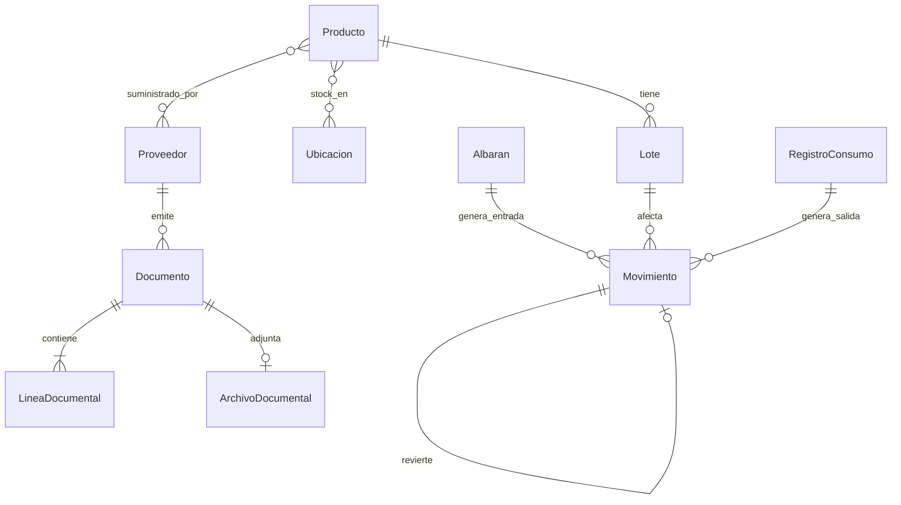

# Modelo de dominio objetivo (Fase 2)

**Estado:** diseño. **No hay modelos nuevos en código en esta fase.**

## 1. Catálogo de entidades

### 1.1 Producto maestro

| Aspecto | Definición |
|---------|------------|
| Responsabilidad | Identidad única del artículo en el hotel |
| Independiente de | Proveedor, ubicación, documento |
| Campos clave (concepto) | id, nombre, unidad, tipo_artículo, categoría, subcategoría, departamento(s) o clasificación, servicios_disponibles, stock_mínimo, activo, es_bebida (legacy/compat) |
| Compatibilidad | Conservar `categoria_inventario`, `servicios_disponibles` (vacío ≠ todos) |

### 1.2 Dimensiones (separadas)

| Entidad | Cardinalidad vs producto | Notas |
|---------|--------------------------|-------|
| Departamento | N:M o clasificación | Economato, cocina, lencería, … |
| Categoría | N:1 o N:M | No mezclar con departamento |
| Subcategoría | N:1 respecto categoría | |
| Ubicación | N:M vía stock/ubicaciones | Cámara, bar, almacén, … |
| Tipo de artículo | N:1 | consumible, reutilizable, herramienta/préstamo, textil, activo |
| Servicio disponible | lista | desayuno/comida/cena/bebidas — distinto de categoría inventario |

### 1.3 Proveedor (Fase 8 — una sola vez)

id interno, nombre fiscal, comercial, NIF/CIF, dirección, contactos, condiciones pago, activo.  
Relación comercial **producto–proveedor** (código proveedor, preferente, etc.).  
Snapshots en líneas documentales; `marca_proveedor` actual = snapshot histórico a conservar.

### 1.4 Impuesto (Fase 8)

id, nombre, porcentaje **Decimal**, vigencia desde/hasta, activo, descripción.  
Versionado: cambiar % no altera históricos (snapshot en línea).

### 1.5 Lote

Extiende el concepto actual `LoteStock`: cantidad original, restante, fechas, coste, producto, origen documental, flags soft-anulación.  
**No** es factura.

### 1.6 Movimiento

Ver [arquitectura_objetivo/ledger_movimientos.md](arquitectura_objetivo/ledger_movimientos.md).

### 1.7 Documentos

| Entidad | Rol |
|---------|-----|
| Documento | Cabecera genérica (tipo, estado, proveedor, fechas, totales) |
| ArchivoDocumental | Original: nombre, MIME, tamaño, SHA-256, ruta/ref, usuario, fecha |
| Albaran | Recepción; al confirmar → entrada + lotes + movimientos |
| Factura | Registro interno de documento recibido (no emisión fiscal a cliente) |
| Rectificativa | Corrección enlazada al original |
| LineaDocumental | Producto, cantidades, precios, impuesto snapshot, enlace lote/albarán |

### 1.8 Operación de consumo (existente → evoluciona)

| Actual | Futuro |
|--------|--------|
| `RegistroDesayuno` | Mantener o unificar gradualmente en `RegistroServicio` |
| `RegistroServicio` | Consumo comida/cena/bebidas |
| `LineaDetalleOrigen` + `consumos_lote` | Fuente de verdad de traza FIFO |
| `RegistroMerma` | Salida tipada + snapshots |
| `RegistroAjuste` | Ajuste de restante |

### 1.9 Identidad y acceso (futuro)

Usuario, Rol, Permiso, Terminal, Sesión (no Streamlit session como auth final).  
Roles iniciales: Dirección, Administración, Economato, Restaurante, Lencería, Mantenimiento, Recepción, …

### 1.10 Auditoría

Actividad / evento de auditoría con actor, acción, detalle, timestamps (ampliar el `Actividad` actual).

## 2. Diagrama de relaciones (simplificado)

## 3. IDs

- Strings estables con prefijo o UUID interno.
- Conservar IDs JSON actuales como `legacy_id` en migración.
- Prohibido ID = proveedor + fecha.

## 4. Estados genéricos

- Catálogos: activo / inactivo  
- Documentos: borrador / confirmado / anulado / rectificado  
- Movimientos: confirmado / anulado_por_reverso  
- Alertas (actual): pendiente / revisada / resuelta / ignorada  

## 5. Snapshots e histórico

Regla: lo que se muestra de un hecho pasado usa snapshot; el catálogo vivo no reescribe historia.  
Ausencia de campo = “dato no disponible / sin desglose histórico”; **sin backfill**.

## 6. Invariantes de dominio (objetivo)

1. Producto no se duplica por cambiar de proveedor.  
2. Traslado no cambia stock total.  
3. Conciliación factura–albarán no incrementa stock.  
4. Anulación sin trazabilidad suficiente → bloqueo.  
5. Reposición exacta a lotes registrados en `consumos_lote` / movimiento original.  
6. Confirmaciones documentales atómicas.  
7. Soft-delete / reverso; no borrado físico de hechos confirmados.  

## 7. Tipos de artículo — reglas iniciales (diseño)

| Tipo | Stock | Movimientos típicos |
|------|-------|---------------------|
| Consumible | Cantidad | entrada, consumo, merma, ajuste |
| Reutilizable | Cantidad / ciclos | préstamo, retorno, baja |
| Herramienta / préstamo | Unidad | préstamo, retorno |
| Textil circulante | Cantidad por ubicación | traslado, recuento |
| Activo individual | 1 unidad identificable | alta, baja, traslado |

No implementar todos en F6C; solo consumible + reutilizable con reglas mínimas al llegar ahí.
